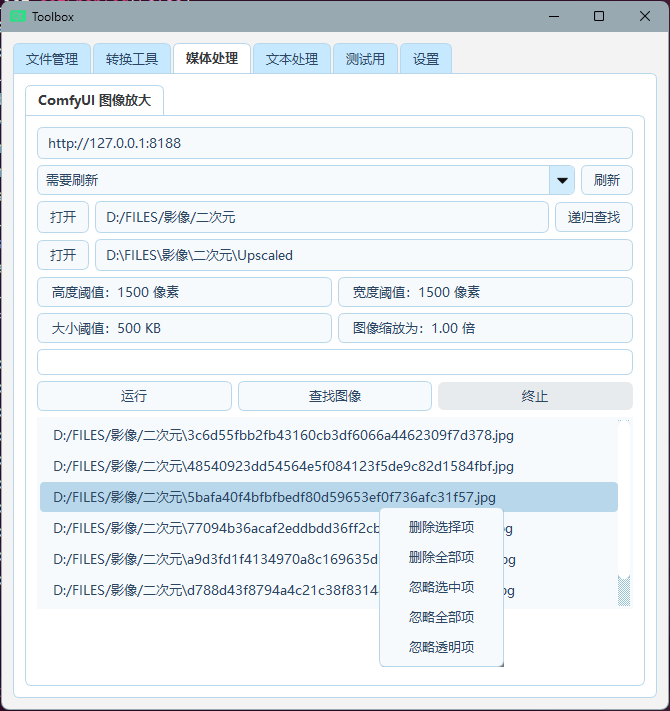
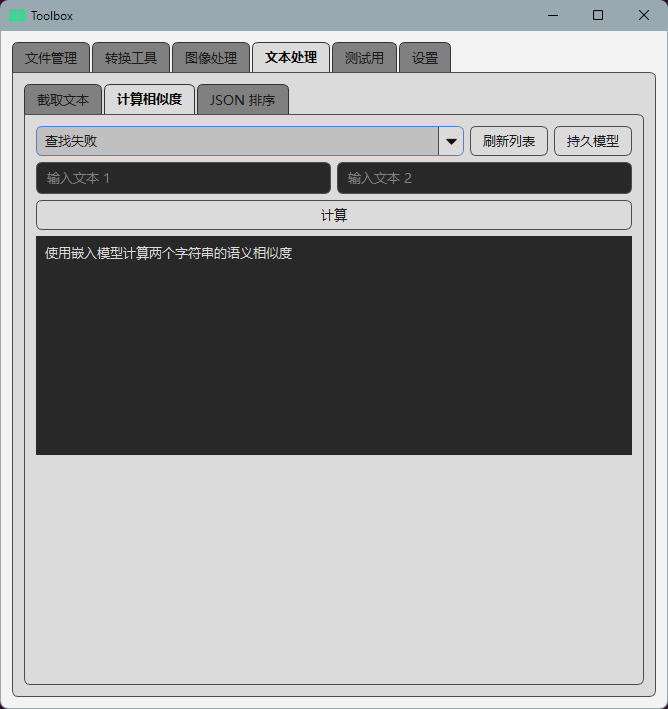
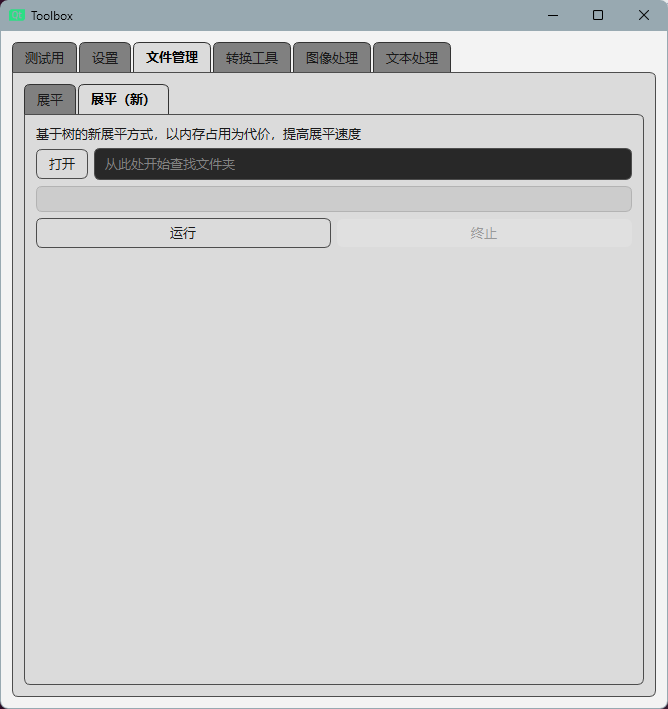

# Just a bunch of random tools - 只是一堆随意的工具

|        |  |
|-------------------------------------------------|---------------------------------------------|
|  |    |

## 当前功能

- 展平文件夹
- PNG 转 JPG
- 图像序列转 PDF
- ComfyUI 图像放大
- 截取文本
- 计算相似度
- JSON 排序
- 生成噪声图像
- 导出 Qt 内置图标
- 设置主题

## 开发计划
- [ ] 把所有功能的反馈模式改为消息框